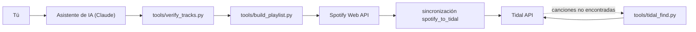
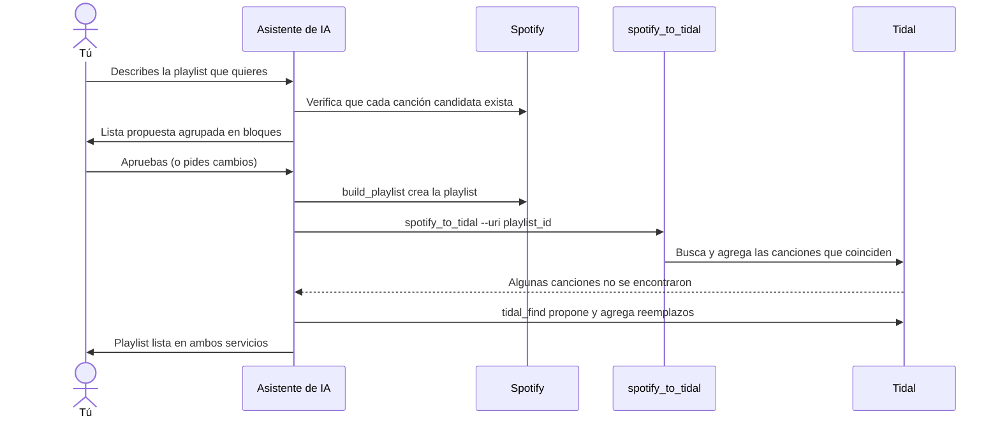
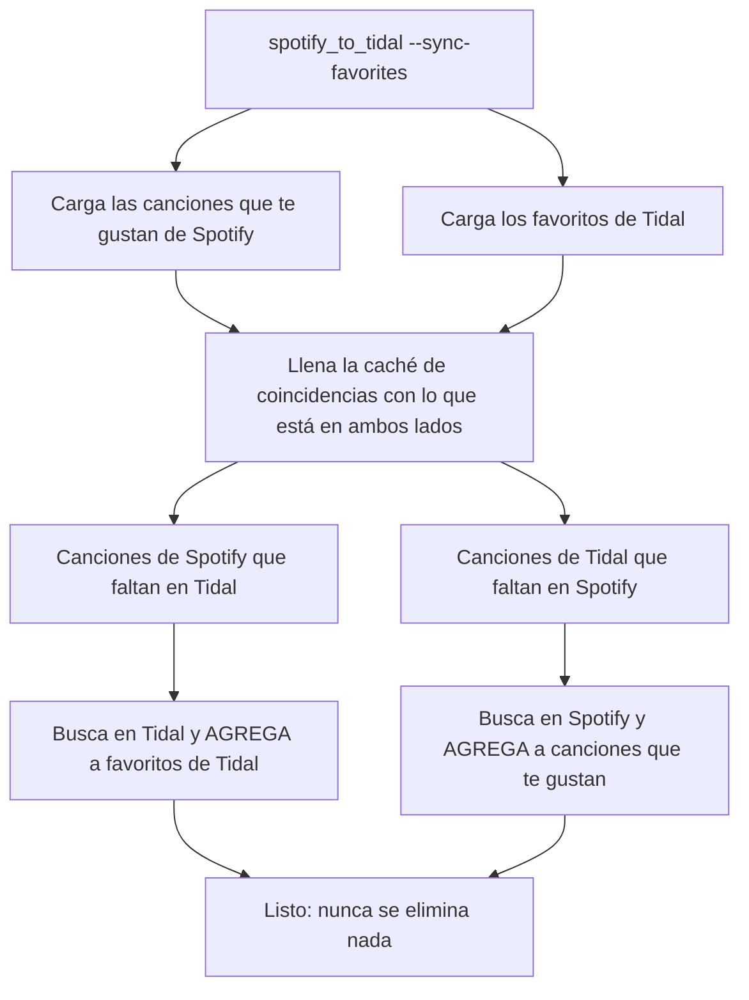

# spotify_to_tidal

**Copia tus playlists y canciones favoritas de Spotify a Tidal, mantenlas sincronizadas e incluso deja que un asistente de IA te arme playlists nuevas.**

[](LICENSE)
[](https://www.python.org/)


**Idioma:** [English](readme.md) | Español

> Este es un fork de [spotify2tidal/spotify_to_tidal](https://github.com/spotify2tidal/spotify_to_tidal), mantenido en [Nicolas6879/spotify_to_tidal](https://github.com/Nicolas6879/spotify_to_tidal).

## Tabla de contenidos

1. [Qué hace](#qué-hace)
2. [Qué agrega este fork](#qué-agrega-este-fork)
3. [Cómo funciona](#cómo-funciona)
4. [Para quien no programa](#para-quien-no-programa)
5. [Inicio rápido para desarrolladores](#inicio-rápido-para-desarrolladores)
6. [Configuración detallada](#configuración-detallada)
7. [Uso](#uso)
8. [Limitaciones y cosas que debes saber](#limitaciones-y-cosas-que-debes-saber)
9. [Solución de problemas](#solución-de-problemas)
10. [Preguntas frecuentes](#preguntas-frecuentes)
11. [Estructura del proyecto](#estructura-del-proyecto)
12. [Apoya el proyecto](#apoya-el-proyecto)
13. [Créditos y licencia](#créditos-y-licencia)

## Qué hace

- Copia tus playlists de Spotify a Tidal (las crea, o actualiza las que ya existen).
- Sincroniza tus "Canciones que te gustan" de Spotify con tus favoritos de Tidal.
- Empareja canciones primero por ISRC y luego por nombre, artista y duración, para elegir la versión correcta.
- Recuerda las canciones que no encontró y las reintenta más adelante, así que sincronizar de nuevo bibliotecas enormes es rápido.
- Guarda las canciones que no encontró en `songs not found.txt` para que las revises.
- Puede sincronizar todo, una lista de playlists de tu configuración o una sola playlist.

## Qué agrega este fork

| Función | Original | Este fork |
|---|---|---|
| Playlists de Spotify a Tidal | Sí | Sí |
| Canciones que te gustan de Spotify a favoritos de Tidal | Sí | Sí |
| Favoritos de Tidal a "Canciones que te gustan" de Spotify (`--sync-favorites`, solo agrega) | No | **Sí** |
| Reintento ante `412 Precondition Failed` de Tidal al agregar canciones a playlists largas (más de 20 canciones) | No | **Sí** |
| Crear playlists curadas en Spotify desde una lista JSON (`tools/build_playlist.py`, usa los endpoints de Spotify de febrero de 2026) | No | **Sí** |
| Verificar que las canciones candidatas existan en Spotify (`tools/verify_tracks.py`) | No | **Sí** |
| Buscar en Tidal y agregar a mano las canciones que faltan (`tools/tidal_find.py`) | No | **Sí** |
| Variable de entorno `SPOTIFY_MARKET` para las búsquedas (por defecto `US`) | No | **Sí** |

## Cómo funciona

### Arquitectura



### Flujo de una playlist curada (con tu aprobación)



### Sincronización de favoritos en ambos sentidos



## Para quien no programa

### ¿Qué es esto, en palabras simples?

Es un programita que mueve tu música entre Spotify y Tidal. Además, puedes pedirle a un asistente de IA como Claude que te diseñe una playlist ("covers instrumentales con chelo, violín y saxo, como 2CELLOS, Lucky Chops y MEUTE"). El asistente comprueba que cada canción exista de verdad, te muestra la lista y solo cuando le dices que sí crea la playlist en Spotify y la copia a Tidal. En la demo para la que se hizo, se creó una playlist de 101 canciones en ambos servicios: 98 se emparejaron solas y 3 se reemplazaron por alternativas.

### Qué necesitas

- Una cuenta de **Spotify Premium** (Spotify lo exige para crear una app de desarrollador).
- Una cuenta de **Tidal**.
- Un computador (Windows, macOS o Linux).
- Un **asistente de IA que pueda ejecutar comandos en tu computador**, como Claude Code o la app de escritorio de Claude.

### Pega esto en tu Claude o asistente de IA

````text
Eres mi asistente de instalación. Ayúdame a instalar y usar el proyecto
https://github.com/Nicolas6879/spotify_to_tidal (un fork de spotify2tidal/spotify_to_tidal),
que copia playlists de Spotify a Tidal y puede crear playlists curadas.
No soy programador: explícame cada paso en lenguaje simple, haz tú el trabajo técnico
y pídeme que actúe solo cuando sea realmente necesario. Ve un paso a la vez y espérame.

REGLAS DE SEGURIDAD
- NUNCA me pidas que pegue en este chat mi client secret de Spotify, tokens ni contraseñas.
- No leas, imprimas ni subas config.yml, .session.yml ni ningún archivo que empiece por .cache.
- No ejecutes git commit ni git push. No borres nada de mis cuentas.

PARTE 1 - INSTALACIÓN
1. Comprueba que Python 3.10 o superior y git estén instalados (python --version, git --version).
   Si falta alguno, dime cómo instalarlo en mi sistema operativo y espérame.
2. Clona https://github.com/Nicolas6879/spotify_to_tidal en una carpeta que yo apruebe y entra en ella.
3. Crea un entorno virtual (python -m venv .venv), actívalo y ejecuta: pip install -e .
4. Copia example_config.yml a config.yml.

PARTE 2 - APP DE SPOTIFY (yo hago los clics, tú me guías)
5. Guíame paso a paso en https://developer.spotify.com/dashboard : iniciar sesión, Create app,
   cualquier nombre y descripción, Redirect URI exactamente http://127.0.0.1:8888/callback ,
   marcar "Web API" y guardar. Recuérdame que el dueño de la app necesita Spotify Premium.
6. Dime que abra config.yml YO MISMO y pegue ahí el Client ID, el Client secret y mi
   nombre de usuario de Spotify, y que guarde. Yo te diré "listo". Nunca me pidas pegarlos aquí.

PARTE 3 - PRIMERA EJECUCIÓN
7. Inicia sesión en ambos servicios SIN cambiar nada todavía (en Windows usa siempre python):
   a) python tools/build_playlist.py playlists/covers_cuerdas_saxo_vientos.json --dry-run
      -> se abre mi navegador para autorizar Spotify (doy clic en Aceptar); solo busca, no crea nada.
   b) python tools/tidal_find.py "test"
      -> aparece en la terminal un enlace de inicio de sesión de Tidal: debo abrirlo e iniciar sesión.
   Espera a que te confirme ambos. NO ejecutes --sync-favorites salvo que yo lo pida: agrega canciones a mis me gusta en ambos servicios.

PARTE 4 - CREAR UNA PLAYLIST
8. Pregúntame qué playlist quiero (ambiente, instrumentos, artistas, tamaño, instrumental o no, idioma).
9. Propón una lista de canciones agrupada en bloques (artista - título). Espera mi aprobación y ajusta si te lo pido.
10. Escribe la lista aprobada como JSON en playlists/<nombre>.json con este formato:
    {"name": "...", "description": "...", "public": false,
     "tracks": [{"artist": "...", "title": "..."}]}
11. Ejecuta: python tools/build_playlist.py playlists/<nombre>.json --dry-run
    Revisa la salida buscando falsos emparejamientos (artista equivocado, versiones en vivo o karaoke, etc.).
    Si pedí música instrumental, marca también las canciones que probablemente tengan voz.
    Corrige el JSON y repite hasta que quede limpio; luego muéstrame un resumen corto.
12. Cuando yo confirme, ejecuta: python tools/build_playlist.py playlists/<nombre>.json
    Imprime el id de la nueva playlist de Spotify.
13. Cópiala a Tidal: python -m spotify_to_tidal --uri <id de la playlist>
14. Lee "songs not found.txt" (ignora las entradas antiguas). Por cada canción faltante, ejecuta
    python tools/tidal_find.py "artista título", ofréceme las mejores alternativas y, cuando yo elija,
    agrégalas con python tools/tidal_find.py --add <id de la playlist en Tidal> <id de la canción>.
15. Termina con un resumen: canciones emparejadas, reemplazadas, omitidas y los nombres de las playlists.

Empieza por el paso 1.
````

### ¿Ya lo tienes instalado? Crea una playlist nueva

````text
El proyecto spotify_to_tidal ya está instalado y configurado en esta carpeta (entorno virtual en .venv,
config.yml listo). No leas ni imprimas config.yml, .session.yml ni archivos .cache*, y nunca hagas commit ni push.
Activa el entorno virtual y luego:
1. Pregúntame qué playlist quiero (ambiente, instrumentos, artistas, tamaño, instrumental o no).
2. Propón una lista de canciones agrupada en bloques y espera mi aprobación.
3. Guárdala como playlists/<nombre>.json, ejecuta python tools/build_playlist.py playlists/<nombre>.json --dry-run,
   revisa falsos emparejamientos (y voces si pedí instrumental) y corrige la lista.
4. Cuando yo confirme, créala sin --dry-run y luego ejecuta python -m spotify_to_tidal --uri <id de la playlist>.
5. Para las canciones que no se encontraron en Tidal, usa python tools/tidal_find.py para ofrecerme reemplazos
   y agrega los que yo elija con --add. Termina con un resumen corto.
````

### Alternativa más rápida

Si solo quieres que Spotify elija las canciones, puedes usar el conector oficial de Spotify para Claude (su herramienta `generate_playlist` deja que la IA de Spotify escoja las canciones; requiere Premium). Después usa esta herramienta para copiar esa playlist a Tidal con `python -m spotify_to_tidal --uri <id de la playlist>`.

## Inicio rápido para desarrolladores

```bash
git clone https://github.com/Nicolas6879/spotify_to_tidal.git
cd spotify_to_tidal
python -m venv .venv && source .venv/bin/activate   # Windows: .venv\Scripts\activate
pip install -e .
cp example_config.yml config.yml                     # luego edítalo, mira "Configuración detallada"
spotify_to_tidal                                     # o: python -m spotify_to_tidal
```

Requiere Python 3.10 o superior. En Windows, ejecútalo como `python -m spotify_to_tidal`.

## Configuración detallada

### 1. Crea tu app de Spotify

1. Entra al [panel de desarrolladores de Spotify](https://developer.spotify.com/dashboard) e inicia sesión.
2. Haz clic en **Create app** y elige un nombre y una descripción.
3. Agrega la Redirect URI `http://127.0.0.1:8888/callback` (debe coincidir exactamente con `redirect_uri` de tu configuración) y presiona **Add**.
4. Marca **Web API** y guarda.
5. Abre los ajustes de la app y copia tú mismo el **Client ID** y el **Client secret** en `config.yml`.

Las apps en Development Mode exigen que el dueño de la app tenga Premium y permiten como máximo 5 usuarios, así que cada persona debería registrar su propia app.

### 2. Configura `config.yml`

Copia `example_config.yml` a `config.yml` y complétalo:

| Opción | Significado |
|---|---|
| `spotify.client_id` / `client_secret` | Credenciales de tu app de Spotify. |
| `spotify.username` | Tu nombre de usuario de Spotify. |
| `spotify.redirect_uri` | Debe ser igual a la Redirect URI registrada en el panel (por defecto `http://127.0.0.1:8888/callback`). |
| `spotify.open_browser` | `True` abre el navegador para autorizar; ponlo en `False` en un servidor sin pantalla. |
| `sync_playlists` | Opcional. Sincroniza solo estas playlists, cada una con un `spotify_id` y un `tidal_id`. |
| `excluded_playlists` | Opcional. Sincroniza todo excepto estas URIs de playlists. |
| `sync_favorites_default` | Si es `true`, los favoritos se sincronizan al ejecutar la herramienta sin argumentos. Si es `false`, solo con `--sync-favorites`. |
| `max_concurrency` | Máximo de conexiones simultáneas (por defecto 10). |
| `rate_limit` | Máximo de peticiones sostenidas por segundo (por defecto 10). Baja ambos valores si ves errores `429`. |

### 3. Inicia sesión en Tidal

En la primera ejecución se imprime un enlace en la terminal (y se abre en tu navegador). Inicia sesión en Tidal ahí. La sesión se guarda en `.session.yml` y se reutiliza después. La primera ejecución de Spotify también abre el navegador para autorizar la app, y te lo pedirá otra vez si cambian los permisos (scopes) requeridos.

## Uso

Todos los comandos se ejecutan desde la raíz del proyecto. En Windows usa `python -m spotify_to_tidal` en vez de `spotify_to_tidal`.

```bash
spotify_to_tidal                              # sincroniza todas las playlists (+ favoritos salvo que lo desactives en la configuración)
spotify_to_tidal --uri 1ABCDEqsABCD6EaABCDa0a # una sola playlist (id o URI completa)
spotify_to_tidal --sync-favorites             # solo favoritos, en ambos sentidos
spotify_to_tidal --config otro.yml            # usa otro archivo de configuración
spotify_to_tidal --help
```

### Favoritos (en ambos sentidos)

`--sync-favorites` agrega tus canciones que te gustan de Spotify a tus favoritos de Tidal, y tus favoritos de Tidal a tus canciones que te gustan de Spotify. Solo agrega: nunca se elimina nada en ninguno de los dos lados.

### Crear playlists

Escribe las canciones en un archivo JSON (hay un ejemplo completo en [playlists/covers_cuerdas_saxo_vientos.json](playlists/covers_cuerdas_saxo_vientos.json)). Cada canción es `artist` + `title`, o bien una `uri` de Spotify:

```json
{
  "name": "Mi playlist",
  "description": "",
  "public": false,
  "tracks": [
    {"artist": "2CELLOS", "title": "Thunderstruck"},
    {"uri": "spotify:track:0PQfyDuJBxQhx3NTUsAYiC"}
  ]
}
```

```bash
python tools/build_playlist.py playlists/mi_playlist.json --dry-run   # revisa los emparejamientos, no crea nada
python tools/build_playlist.py playlists/mi_playlist.json             # la crea e imprime el id de la playlist
spotify_to_tidal --uri <id de la playlist>                            # cópiala a Tidal
```

Lee siempre la salida del dry-run buscando falsos emparejamientos. Para comprobar primero una lista de candidatas en bloque, usa `python tools/verify_tracks.py candidates.json results.json`. Las herramientas leen `config.yml` del directorio actual, así que ejecútalas desde la raíz del proyecto.

### Canciones que faltan en Tidal

```bash
python tools/tidal_find.py "artista título"                              # lista candidatas en Tidal
python tools/tidal_find.py --add <id playlist Tidal> <id canción> ...    # agrega las canciones elegidas a una playlist de Tidal
```

### Mercado de búsqueda

Las búsquedas en Spotify usan el mercado de la variable de entorno `SPOTIFY_MARKET` (por defecto `US`), porque algunas canciones tienen bloqueo regional:

```bash
SPOTIFY_MARKET=MX python tools/build_playlist.py playlists/mi_playlist.json --dry-run
# PowerShell: $env:SPOTIFY_MARKET = "MX"
```

## Limitaciones y cosas que debes saber

- Las apps de Spotify en Development Mode exigen que el dueño tenga Premium y permiten como máximo 5 usuarios, así que registra tu propia app.
- Los refresh tokens de Spotify pueden expirar tras unos 6 meses. Solo vuelve a autorizar en el navegador.
- `tidalapi` es una librería no oficial de Tidal, así que cambios del lado de Tidal pueden romper cosas.
- Algunas canciones o versiones simplemente no existen en Tidal (grabaciones clásicas, remasters). Se anotan en `songs not found.txt`, que se va ampliando en cada ejecución.
- Las canciones que agregues a mano en Tidal a una playlist sincronizada pueden sobrescribirse si vuelves a sincronizar esa playlist desde Spotify.
- El mercado de búsqueda importa: las canciones con bloqueo regional pueden no encontrarse.
- La sincronización de favoritos solo agrega. Para quitar una canción, quítala tú en ambos servicios.
- Problema conocido del proyecto original: la lectura de playlists todavía espera el campo `track` de los elementos de Spotify, que Spotify renombró en sus cambios de API de febrero de 2026. Si te sale `KeyError: 'track'`, esa es la causa; este fork aún no lo corrige.

## Solución de problemas

| Problema | Causa | Solución |
|---|---|---|
| `403 Insufficient client scope` | Falta un permiso o el parámetro de mercado es incorrecto | Borra el archivo `.cache-<usuario>` y ejecuta de nuevo para volver a autorizar en el navegador; revisa `SPOTIFY_MARKET`. |
| `412 Precondition Failed` en Tidal | Tidal rechaza un agregado justo después del bloque anterior (estado desactualizado) | Este fork lo maneja con reintentos automáticos. Actualiza a la última versión. |
| `KeyError: 'track'` | Spotify renombró campos en la API de febrero de 2026 | Problema conocido, ver arriba. |
| El navegador se abre pero el login falla | La Redirect URI no coincide | Asegúrate de que `redirect_uri` en `config.yml` sea igual a la del panel, carácter por carácter. |
| El login de Spotify deja de funcionar tras meses | El refresh token expiró | Borra `.cache-<usuario>` y autoriza de nuevo. |
| Errores `429` | Demasiadas peticiones | Baja `max_concurrency` y `rate_limit` en `config.yml`. |
| Tidal vuelve a pedir login | La sesión guardada expiró | Borra `.session.yml` y ejecuta de nuevo. |
| El comando `spotify_to_tidal` no se encuentra en Windows | Windows ignora las rutas de módulos | Usa `python -m spotify_to_tidal`. |
| Una canción no está en Tidal | No disponible, o es otra versión | Usa `tools/tidal_find.py` para elegir un reemplazo. |

## Preguntas frecuentes

**¿Es gratis?** El software es gratuito y de código abierto. Igual necesitas tu propia suscripción a Tidal, y Spotify Premium para crear la app de desarrollador.

**¿Mis datos están seguros?** Tus credenciales se quedan en tu computador, en `config.yml`, `.session.yml` y los archivos `.cache*`, todos incluidos en `.gitignore`. No se envía nada a ningún lado salvo a Spotify y Tidal. Nunca pegues tu client secret en un chat y nunca subas esos archivos a git.

**¿Va a borrar mis canciones?** La sincronización de favoritos solo agrega y nunca elimina nada. La sincronización de playlists hace que la copia en Tidal siga a la playlist de Spotify, así que edita las playlists sincronizadas en Spotify.

**¿Puedo ejecutarlo periódicamente?** Sí. Está optimizado para sincronizaciones repetidas de bibliotecas grandes.

**¿Necesito un asistente de IA?** No. Solo hace falta para el flujo de playlists curadas. La sincronización funciona por sí sola.

**¿Tiene relación con Spotify o Tidal?** No.

## Estructura del proyecto

```text
spotify_to_tidal/
├── src/spotify_to_tidal/
│   ├── __main__.py        # punto de entrada de la línea de comandos
│   ├── auth.py            # login en Spotify y Tidal
│   ├── sync.py            # lógica de emparejamiento y sincronización
│   ├── cache.py           # recuerda canciones no encontradas (.cache.db)
│   ├── tidalapi_patch.py  # utilidades y arreglos de Tidal (agregados por bloques, reintento 412)
│   └── type/              # definiciones de tipos
├── tools/
│   ├── verify_tracks.py   # comprueba que las candidatas existan en Spotify
│   ├── build_playlist.py  # crea una playlist de Spotify desde JSON
│   └── tidal_find.py      # busca en Tidal y agrega canciones
├── playlists/             # playlist JSON de ejemplo
├── tests/
├── example_config.yml
├── pyproject.toml
└── LICENSE
```

## Apoya el proyecto

<!-- TODO: reemplaza REPLACE_ME por el usuario real de Buy Me a Coffee y el handle de GitHub Sponsors -->
Si esto te ahorró tiempo, puedes apoyar el proyecto:

- [Invítame un café](https://buymeacoffee.com/REPLACE_ME)
- [GitHub Sponsors](https://github.com/sponsors/REPLACE_ME)

## Créditos y licencia

Proyecto original de los [colaboradores de spotify2tidal](https://github.com/spotify2tidal/spotify_to_tidal/graphs/contributors). Este fork lo mantiene Nicolas ([@Nicolas6879](https://github.com/Nicolas6879)).

Licenciado bajo la [GNU AGPL-3.0](LICENSE): puedes usarlo, modificarlo y compartirlo, pero cualquier versión modificada que distribuyas o ejecutes como servicio en red también debe publicarse como código abierto bajo la misma licencia.

---

#### Únete a nuestra increíble comunidad de colaboradores de código
<br><br>
<a href="https://github.com/spotify2tidal/spotify_to_tidal/graphs/contributors">
  
</a>
