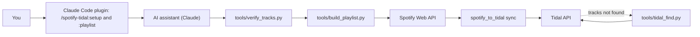
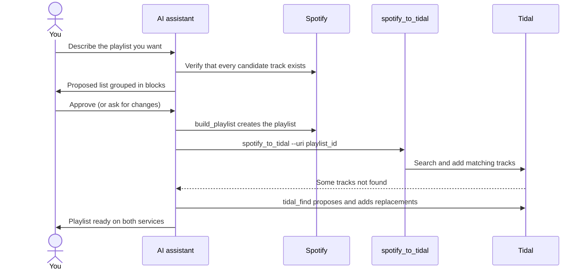
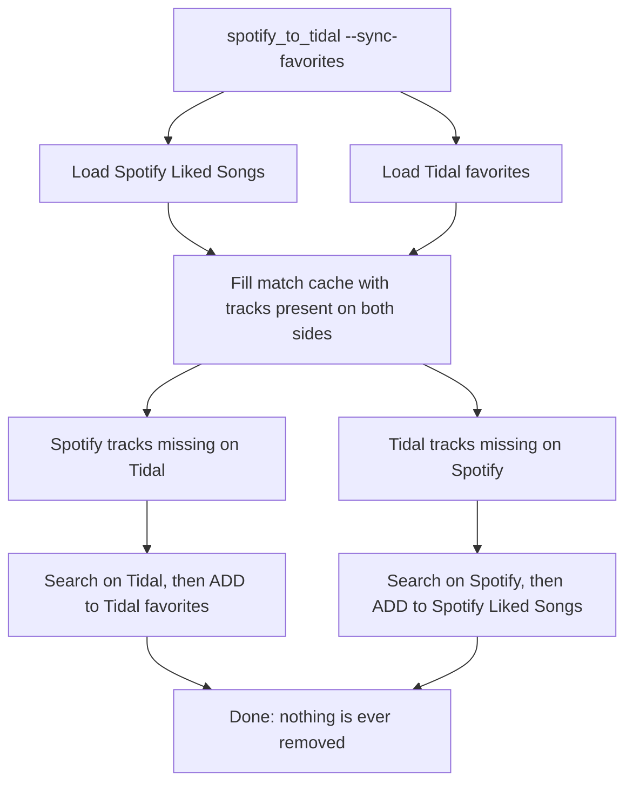

# spotify_to_tidal

**Describe a playlist, approve the list, and get it on Spotify and Tidal.**

Ask Claude for a playlist in plain words. It proposes the songs, checks that each one really exists, and only after your OK creates the playlist on Spotify and copies it to Tidal, finding replacements for anything Tidal lacks. It also syncs your existing Spotify playlists and likes to Tidal.

[](LICENSE)
[](https://www.python.org/)
[](#use-it-from-claude-code-plugin)


**Language:** English | [Español](README.es.md)

> This is a fork of [spotify2tidal/spotify_to_tidal](https://github.com/spotify2tidal/spotify_to_tidal), maintained at [Nicolas6879/spotify_to_tidal](https://github.com/Nicolas6879/spotify_to_tidal).

## 30-second demo

**You say:**

```text
/spotify-tidal:playlist instrumental covers with cello, violin and sax like 2CELLOS, Lucky Chops, MEUTE + movie themes
```

**You get:** a 101-track playlist on Spotify, built from a list you approved and checked track by track. On Tidal, 98 tracks matched automatically and 3 were replaced with alternatives you chose.

**Install in 3 lines** (inside Claude Code):

```text
/plugin marketplace add Nicolas6879/spotify_to_tidal
/plugin install spotify-tidal@spotify-tidal-playlists
/spotify-tidal:setup
```

## Table of contents

1. [30-second demo](#30-second-demo)
2. [Use it from Claude Code (plugin)](#use-it-from-claude-code-plugin)
3. [What it does](#what-it-does)
4. [What this fork adds](#what-this-fork-adds)
5. [How it works](#how-it-works)
6. [For non-developers](#for-non-developers)
7. [Quick start for developers](#quick-start-for-developers)
8. [Detailed setup](#detailed-setup)
9. [Usage](#usage)
10. [Limitations and good to know](#limitations-and-good-to-know)
11. [Troubleshooting](#troubleshooting)
12. [FAQ](#faq)
13. [For AI assistants](#for-ai-assistants)
14. [Project structure](#project-structure)
15. [Credits and license](#credits-and-license)

## Use it from Claude Code (plugin)

This repo is also a Claude Code plugin marketplace. Inside Claude Code:

```text
/plugin marketplace add Nicolas6879/spotify_to_tidal
/plugin install spotify-tidal@spotify-tidal-playlists
/spotify-tidal:setup
/spotify-tidal:playlist instrumental covers with cello and sax, 40 songs
```

| Skill | What it does |
|---|---|
| `/spotify-tidal:setup` | Guided install for non-developers: checks Python and git, clones the repo, creates the virtual environment, walks you through the Spotify developer app, and does a login-only first run (creates nothing). You type your credentials into `config.yml` yourself, never in the chat. |
| `/spotify-tidal:playlist <request>` | The curated workflow: proposes a list for your approval, verifies every track, removes false matches, creates the playlist on Spotify, copies it to Tidal and proposes replacements for missing songs. It can also use the official Spotify connector (`generate_playlist`) as a quick mode. |

## What it does

- Copies your Spotify playlists to Tidal (creates them, or updates the ones that already exist).
- Syncs your Spotify "Liked Songs" with your Tidal favorites.
- Matches tracks by ISRC first, then by name, artist and duration, so the right version of a song is picked.
- Remembers tracks it could not find and retries them later, which makes repeated syncs of very large libraries fast.
- Writes the tracks it could not find to `songs not found.txt` so you can review them.
- Can sync everything, a list of playlists from your config, or a single playlist.

## What this fork adds

| Feature | Upstream | This fork |
|---|---|---|
| Spotify playlists to Tidal | Yes | Yes |
| Spotify Liked Songs to Tidal favorites | Yes | Yes |
| Tidal favorites to Spotify Liked Songs (`--sync-favorites`, add-only) | No | **Yes** |
| Retry on Tidal `412 Precondition Failed` when adding tracks to long playlists (more than 20 tracks) | No | **Yes** |
| Build curated Spotify playlists from a JSON list (`tools/build_playlist.py`, uses the Spotify February 2026 endpoints) | No | **Yes** |
| Verify that candidate tracks exist on Spotify (`tools/verify_tracks.py`) | No | **Yes** |
| Search Tidal and add missing tracks by hand (`tools/tidal_find.py`) | No | **Yes** |
| `SPOTIFY_MARKET` environment variable for searches (default `US`) | No | **Yes** |

## How it works

### Architecture



### Curated playlist flow (with your approval)



### Two-way favorites sync



## For non-developers

### What is this, in plain words?

It is a small program that moves your music between Spotify and Tidal. On top of that, you can ask an AI assistant such as Claude to design a playlist for you ("instrumental covers with cello, violin and sax, like 2CELLOS, Lucky Chops and MEUTE"). The assistant checks that every song really exists, shows you the list, and only after you say yes does it create the playlist on Spotify and copy it to Tidal. In the demo this was built for, a 101-track playlist was created on both services: 98 tracks matched automatically and 3 were replaced with alternatives.

### What you need

- A **Spotify Premium** account (Spotify requires it to create a developer app).
- A **Tidal** account.
- A computer (Windows, macOS or Linux).
- An **AI assistant that can run commands on your computer**, such as Claude Code or the Claude desktop app.

### Easiest path: the Claude Code plugin

If you use Claude Code, install the plugin and let it guide you (see [Use it from Claude Code](#use-it-from-claude-code-plugin)):

```text
/plugin marketplace add Nicolas6879/spotify_to_tidal
/plugin install spotify-tidal@spotify-tidal-playlists
/spotify-tidal:setup
```

### Alternative: paste this into your Claude or AI assistant (no plugin needed)

Use this if your assistant does not support plugins.

````text
You are my setup assistant. Help me install and use the project
https://github.com/Nicolas6879/spotify_to_tidal (a fork of spotify2tidal/spotify_to_tidal),
which copies Spotify playlists to Tidal and can build curated playlists.
I am not a developer: explain each step in plain language, do the technical work yourself,
and only ask me to act when it is truly necessary. Go one step at a time and wait for me.

SECURITY RULES
- NEVER ask me to paste my Spotify client secret, tokens or passwords in this chat.
- Do not read, print or upload config.yml, .session.yml or any file starting with .cache.
- Do not run git commit or git push. Do not delete anything from my accounts.

PART 1 - INSTALL
1. Check that Python 3.10 or newer and git are installed (python --version, git --version).
   If one is missing, tell me how to install it for my operating system and wait for me.
2. Clone https://github.com/Nicolas6879/spotify_to_tidal into a folder I agree on, and cd into it.
3. Create a virtual environment (python -m venv .venv), activate it, and run: pip install -e .
4. Copy example_config.yml to config.yml.

PART 2 - SPOTIFY APP (I do the clicking, you guide me)
5. Guide me step by step through https://developer.spotify.com/dashboard : log in, Create app,
   any name and description, Redirect URI exactly http://127.0.0.1:8888/callback ,
   check "Web API", save. Remind me that the app owner needs Spotify Premium.
6. Tell me to open config.yml MYSELF and paste the Client ID, the Client secret and my
   Spotify username there, then save. I will tell you "done". Never ask me to paste them here.

PART 3 - FIRST RUN
7. Log in to both services WITHOUT changing anything yet (on Windows always use python -m / python):
   a) python tools/build_playlist.py playlists/covers_cuerdas_saxo_vientos.json --dry-run
      -> my browser opens to authorize Spotify (I click Agree); this only searches, it creates nothing.
   b) python tools/tidal_find.py "test"
      -> a Tidal login link appears in the terminal: I must open it and log in.
   Wait until I confirm both. Do NOT run --sync-favorites unless I ask: it adds songs to my likes on both services.

PART 4 - CREATE A PLAYLIST
8. Ask me what playlist I want (mood, instruments, artists, size, instrumental or not, language).
9. Propose a list of tracks grouped in blocks (artist - title). Wait for my approval and adjust if I ask.
10. Write the approved list as JSON in playlists/<name>.json using this format:
    {"name": "...", "description": "...", "public": false,
     "tracks": [{"artist": "...", "title": "..."}]}
11. Run: python tools/build_playlist.py playlists/<name>.json --dry-run
    Review the output for false matches (wrong artist, live or karaoke versions, etc.).
    If I asked for instrumental music, also flag tracks that probably have vocals.
    Fix the JSON and repeat until it is clean, then show me a short summary.
12. After I confirm, run: python tools/build_playlist.py playlists/<name>.json
    It prints the new Spotify playlist id.
13. Copy it to Tidal: python -m spotify_to_tidal --uri <playlist id>
14. Read "songs not found.txt" (ignore older entries). For each missing track, run
    python tools/tidal_find.py "artist title", offer me the best alternatives, and after I choose,
    add them with python tools/tidal_find.py --add <tidal playlist id> <track id>.
15. Finish with a summary: tracks matched, tracks replaced, tracks skipped, and the playlist names.

Start with step 1.
````

### Already installed? Create a new playlist

````text
The project spotify_to_tidal is already installed and configured in this folder (virtual environment in .venv,
config.yml ready). Do not read or print config.yml, .session.yml or .cache* files, and never commit or push.
Activate the virtual environment, then:
1. Ask me what playlist I want (mood, instruments, artists, size, instrumental or not).
2. Propose a list of tracks grouped in blocks and wait for my approval.
3. Save it as playlists/<name>.json, run python tools/build_playlist.py playlists/<name>.json --dry-run,
   review false matches (and vocals if I asked for instrumental), and fix the list.
4. After I confirm, create it without --dry-run, then run python -m spotify_to_tidal --uri <playlist id>.
5. For tracks listed as not found on Tidal, use python tools/tidal_find.py to offer replacements
   and add the ones I choose with --add. Finish with a short summary.
````

### Quicker alternative

If you only want Spotify to pick the songs, you can use the official Spotify connector for Claude (its `generate_playlist` tool lets Spotify's AI choose the tracks; it needs Premium). Then use this tool to copy that playlist to Tidal with `python -m spotify_to_tidal --uri <playlist id>`.

## Quick start for developers

```bash
git clone https://github.com/Nicolas6879/spotify_to_tidal.git
cd spotify_to_tidal
python -m venv .venv && source .venv/bin/activate   # Windows: .venv\Scripts\activate
pip install -e .
cp example_config.yml config.yml                     # then edit it, see "Detailed setup"
spotify_to_tidal                                     # or: python -m spotify_to_tidal
```

Requires Python 3.10 or newer. On Windows, run it as `python -m spotify_to_tidal`.

## Detailed setup

### 1. Create your Spotify app

1. Go to the [Spotify developer dashboard](https://developer.spotify.com/dashboard) and log in.
2. Click **Create app** and choose a name and description.
3. Add the Redirect URI `http://127.0.0.1:8888/callback` (it must match `redirect_uri` in your config exactly) and press **Add**.
4. Select **Web API** and save.
5. Open the app settings and copy the **Client ID** and **Client secret** into `config.yml` yourself.

Apps in Development Mode require the app owner to have Premium and allow at most 5 users, so every person should register their own app.

### 2. Configure `config.yml`

Copy `example_config.yml` to `config.yml` and fill it in:

| Option | Meaning |
|---|---|
| `spotify.client_id` / `client_secret` | Credentials of your Spotify app. |
| `spotify.username` | Your Spotify username. |
| `spotify.redirect_uri` | Must equal the Redirect URI registered in the dashboard (default `http://127.0.0.1:8888/callback`). |
| `spotify.open_browser` | `True` opens the browser for authorization; set `False` on a headless server. |
| `sync_playlists` | Optional. Only sync these playlists, each with a `spotify_id` and a `tidal_id`. |
| `excluded_playlists` | Optional. Sync everything except these playlist URIs. |
| `sync_favorites_default` | If `true`, favorites are synced when you run the tool without arguments. If `false`, only with `--sync-favorites`. |
| `max_concurrency` | Maximum simultaneous connections (default 10). |
| `rate_limit` | Maximum sustained requests per second (default 10). Lower both values if you see `429` errors. |

### 3. Log in to Tidal

On the first run a link is printed in the terminal (and opened in your browser). Log in to Tidal there. The session is saved in `.session.yml` and reused afterwards. The first Spotify run also opens the browser to authorize the app, and you are asked again if the required permissions (scopes) change.

## Usage

All commands run from the project root. On Windows use `python -m spotify_to_tidal` instead of `spotify_to_tidal`.

```bash
spotify_to_tidal                              # sync all playlists (+ favorites unless disabled in config)
spotify_to_tidal --uri 1ABCDEqsABCD6EaABCDa0a # one playlist (id or full URI)
spotify_to_tidal --sync-favorites             # favorites only, in both directions
spotify_to_tidal --config other.yml           # use a different config file
spotify_to_tidal --help
```

### Favorites (two-way)

`--sync-favorites` adds your Spotify Liked Songs to your Tidal favorites and your Tidal favorites to your Spotify Liked Songs. It is add-only: nothing is ever removed on either side.

### Building playlists

Write the tracks in a JSON file (a full example is in [playlists/covers_cuerdas_saxo_vientos.json](playlists/covers_cuerdas_saxo_vientos.json)). Each track is either `artist` + `title`, or a Spotify `uri`:

```json
{
  "name": "My playlist",
  "description": "",
  "public": false,
  "tracks": [
    {"artist": "2CELLOS", "title": "Thunderstruck"},
    {"uri": "spotify:track:0PQfyDuJBxQhx3NTUsAYiC"}
  ]
}
```

```bash
python tools/build_playlist.py playlists/my_playlist.json --dry-run   # review matches, creates nothing
python tools/build_playlist.py playlists/my_playlist.json             # creates it and prints the playlist id
spotify_to_tidal --uri <playlist id>                                  # copy it to Tidal
```

Always read the dry-run output for false matches. To check a list of candidates in bulk first, use `python tools/verify_tracks.py candidates.json results.json`. The tools read `config.yml` from the current directory, so run them from the project root.

### Tracks missing on Tidal

```bash
python tools/tidal_find.py "artist title"                            # list candidates on Tidal
python tools/tidal_find.py --add <tidal playlist id> <track id> ...  # add chosen tracks to a Tidal playlist
```

### Search market

Spotify searches use the market from the `SPOTIFY_MARKET` environment variable (default `US`), because some tracks are region-locked:

```bash
SPOTIFY_MARKET=MX python tools/build_playlist.py playlists/my_playlist.json --dry-run
# PowerShell: $env:SPOTIFY_MARKET = "MX"
```

## Limitations and good to know

- Spotify apps in Development Mode need the owner to have Premium and allow at most 5 users, so register your own app.
- Spotify refresh tokens may expire after about 6 months. Just authorize again in the browser.
- `tidalapi` is an unofficial Tidal library, so changes on Tidal's side can break things.
- Some tracks or versions simply do not exist on Tidal (classical recordings, remasters). They are written to `songs not found.txt`, which is appended to on every run.
- Tracks you add by hand on Tidal to a synced playlist can be overwritten if you sync that playlist from Spotify again.
- The search market matters: region-locked tracks may not be found.
- Favorites sync only adds. To remove a song, remove it on both services yourself.
- Known upstream issue: playlist reading still expects the `track` field of Spotify playlist items, which Spotify renamed in its February 2026 API changes. If you get `KeyError: 'track'`, that is the cause; it is not fixed in this fork yet.

## Troubleshooting

| Problem | Cause | Fix |
|---|---|---|
| `403 Insufficient client scope` | Missing permission or wrong market parameter | Delete the `.cache-<username>` file and run again to re-authorize in the browser; check `SPOTIFY_MARKET`. |
| `412 Precondition Failed` on Tidal | Tidal rejects an add right after the previous chunk (stale state) | Handled in this fork by automatic retries. Update to the latest version. |
| `KeyError: 'track'` | Spotify renamed fields in the February 2026 API | Known issue, see above. |
| Browser opens but login fails | Redirect URI mismatch | Make sure `redirect_uri` in `config.yml` equals the one in the dashboard, character for character. |
| Spotify login stops working after months | Refresh token expired | Delete `.cache-<username>` and authorize again. |
| `429` errors | Too many requests | Lower `max_concurrency` and `rate_limit` in `config.yml`. |
| Tidal asks for login again | Saved session expired | Delete `.session.yml` and run again. |
| `spotify_to_tidal` command not found on Windows | Module paths are ignored | Use `python -m spotify_to_tidal`. |
| A song is not on Tidal | Not available, or a different version | Use `tools/tidal_find.py` to pick a replacement. |

## FAQ

**Is it free?** The software is free and open source. You still need your own Tidal subscription, and Spotify Premium to create the developer app.

**Is my data safe?** Your credentials stay on your computer in `config.yml`, `.session.yml` and `.cache*` files, all listed in `.gitignore`. Nothing is sent anywhere except to Spotify and Tidal. Never paste your client secret into a chat and never commit these files.

**Will it delete my songs?** Favorites sync is add-only and never removes anything. Playlist sync makes the Tidal copy follow the Spotify playlist, so edit synced playlists on Spotify.

**Can I run it periodically?** Yes. It is optimized for repeated syncs of large libraries.

**Do I need an AI assistant?** No. It is only needed for the curated-playlist workflow. The sync works on its own.

**Is it affiliated with Spotify or Tidal?** No.

## For AI assistants

- [AGENTS.md](AGENTS.md): operating manual (layout, exact commands, JSON format, safety rules, known issues). `CLAUDE.md` imports it.
- [llms.txt](llms.txt): index of the docs and tools for LLMs.
- [plugins/spotify-tidal/skills/setup/SKILL.md](plugins/spotify-tidal/skills/setup/SKILL.md): guided installation.
- [plugins/spotify-tidal/skills/playlist/SKILL.md](plugins/spotify-tidal/skills/playlist/SKILL.md): curated playlist workflow.

Never read or print `config.yml`, `.session.yml` or `.cache*` files, and never commit or push unless the user asks.

## Project structure

```text
spotify_to_tidal/
├── .claude-plugin/
│   └── marketplace.json   # makes this repo a Claude Code plugin marketplace
├── plugins/spotify-tidal/
│   ├── .claude-plugin/plugin.json
│   └── skills/
│       ├── setup/SKILL.md     # /spotify-tidal:setup
│       └── playlist/SKILL.md  # /spotify-tidal:playlist
├── AGENTS.md              # operating manual for AI agents
├── CLAUDE.md              # imports AGENTS.md
├── llms.txt               # docs index for LLMs
├── src/spotify_to_tidal/
│   ├── __main__.py        # command line entry point
│   ├── auth.py            # Spotify and Tidal login
│   ├── sync.py            # matching and sync logic
│   ├── cache.py           # remembers tracks not found (.cache.db)
│   ├── tidalapi_patch.py  # Tidal helpers and fixes (chunked adds, 412 retry)
│   └── type/              # type definitions
├── tools/
│   ├── verify_tracks.py   # check candidates exist on Spotify
│   ├── build_playlist.py  # create a Spotify playlist from JSON
│   └── tidal_find.py      # search Tidal and add tracks
├── playlists/             # example JSON playlist
├── tests/
├── example_config.yml
├── pyproject.toml
└── LICENSE
```

## Credits and license

Original project by the [spotify2tidal contributors](https://github.com/spotify2tidal/spotify_to_tidal/graphs/contributors). This fork is maintained by Nicolas ([@Nicolas6879](https://github.com/Nicolas6879)).

Licensed under the [GNU AGPL-3.0](LICENSE): you may use, modify and share it, but any modified version you distribute or run as a network service must also be released as open source under the same license.

---

#### Join our amazing community as a code contributor
<br><br>
<a href="https://github.com/spotify2tidal/spotify_to_tidal/graphs/contributors">
  
</a>
